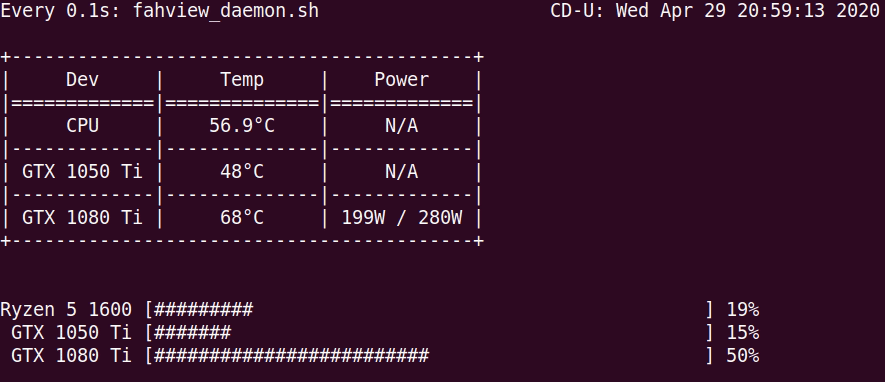

# FAHView
A Pure CLI Script for Monitoring Crucial Information While Running Folding@Home.
###### Project Started: April 29, 2020

## Current Stage
At the moment, this script is hard coded to work with my system setup only. Temperature values and folding progress will show up for any system with one CPU of any brand and two Nvidia GPUs. However, names of those device will likely be off.

## TO-DO:
* Overall touch-up with formatting and color scheme.
* Dynamic coding ensuring cross-system compatibility.
* Combining the two files into one.
* Exceptions Handling.

Please feel free to make any contributions to this project as it is the first project delicated to headless Folding@Home monitoring.
