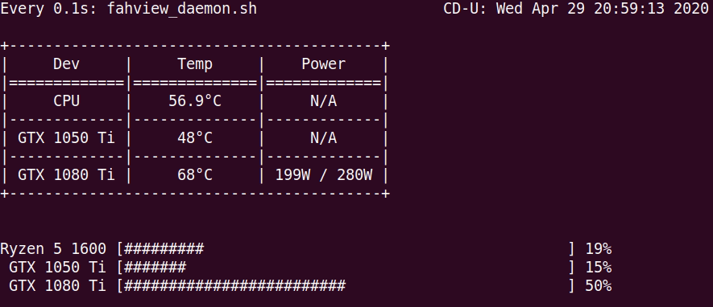

# FAHView :syringe:
A Pure CLI Script for Monitoring Crucial Information While Running Folding@Home. :desktop_computer: :floppy_disk: :fire: :+1:
###### Project Started: April 29, 2020
 

## :hammer: Current Build
I have merged branch 'dynamic-gpu' with master, the current code can detect CPU and GPUs. However, if not all hardwares are added to folding slot, the progress bar may display mixed up info.

## Update
GPU auto-detection feature coming soon!

 

## :pill: TO-DO
- [ ] Rewrite the code to make API request less frequently.
- [ ] Overall touch-up with formatting and color scheme.
- [x] Display donor name, team name, and ranks.
- [ ] Dynamic coding ensuring cross-system compatibility.
- [ ] Combining the two files into one.
- [ ] Exceptions Handling.
- [ ] Compile and package into proper command.:package:

 

## :mega: Notice
Please feel free to make any contributions to this project as it is the first project delicated to headless Folding@Home monitoring.
